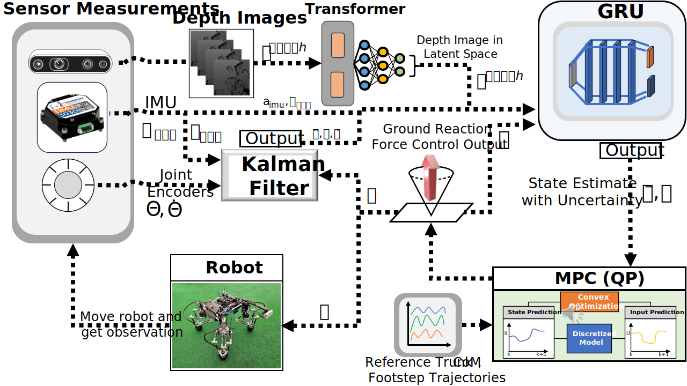

# OptiState (Code example)
State Estimation of Legged Robots using Gated Networks
with Transformer-based Vision and Kalman Filtering.

Accpeted to the International Conference on Robotics and Automation (ICRA 2024). 
Authors: Alexander Schperberg, Yusuke Tanaka, Saviz Mowlavi, Feng Xu, Bharathan Balaji, and Dennis Hong

Please cite the following paper: Schperberg, Alexander, Yusuke Tanaka, Saviz Mowlavi, Feng Xu, Bharathan Balaji, and Dennis Hong. "OptiState: State Estimation of Legged Robots using Gated Networks with Transformer-based Vision and Kalman Filtering." arXiv e-prints (2024): arXiv-2401.

System tested: Ubuntu 20.04, Python 3.8
## Runing our State Estimation example (from data collection to evaluation)
## Installation
1. git clone this repository inside desired folder
2. Install Conda: [Link to Conda Installation](https://docs.conda.io/projects/conda/en/latest/user-guide/install/linux.html) -- Ensure it's Python 3.8 --
3. Go into OptiState directory
4. `conda env update --file environment.yml` - Name of environment will be OptiState
5. `conda activate OptiState`
6. Due to issue with torch version with our transformer, it is necessary to modify python3.8/site-packages/torch/_six.py and replace line 6 or from torch._six import container_abcs with import collections.abc as container_abcs
## Running OptiState 
## Converting Raw Data to Data for Training
We provide two raw sample data in the form of .mat files, which can be downloaded here: https://drive.google.com/drive/folders/1K1ZFdDBoSRxEqZ_bG3Np4DfH5AKo-iU5?usp=drive_link. 
Once downloaded, put the folders into the OptiState/trajectories folder.
To see plots during conversion process, go to settings.py file and set VISUALIZE_DATA_CONVERSION=True. Make sure to press x on each plot window to continue the loop to process all the trajectories.

7. From the OptiState directory run: `python3 data_collection/data_conversion_raw_to_Kalman.py`

8. From the OptiState directory run: `python3 data_collection/data_conversion_Kalman_to_Training.py`
After steps 7 and 8, we have a pickle file called rnn_data.pkl, which contains all the trajectories from the .mat files into a data format used for training. Additionally, we save raw depth images from the .mat files, into a folder called saved_images, which contain all the .png files that you can view.

## Training the Transformer (must complete steps 7-8 first)
9. `python3 transformer/autoencoder_training.py -save_model_name transformer/trans_encoder_model -training_log_save transformer_log`

## Evaluating the Transformer (Optional)
To evaluate the transformer run the following command, you will see two images, the input image on the left side, and the reconstructed image from the transformer encoder/decoder on the right side. 

10. `python3 transformer/autoencoder_load.py -load_model_name trans_encoder_model`

## Training the GRU (must complete steps 7 - 9 first)
11. `python3 gru/gru_train.py`

## Evaluating the GRU (Optional)
12. `python3 gru/gru_test.py`

